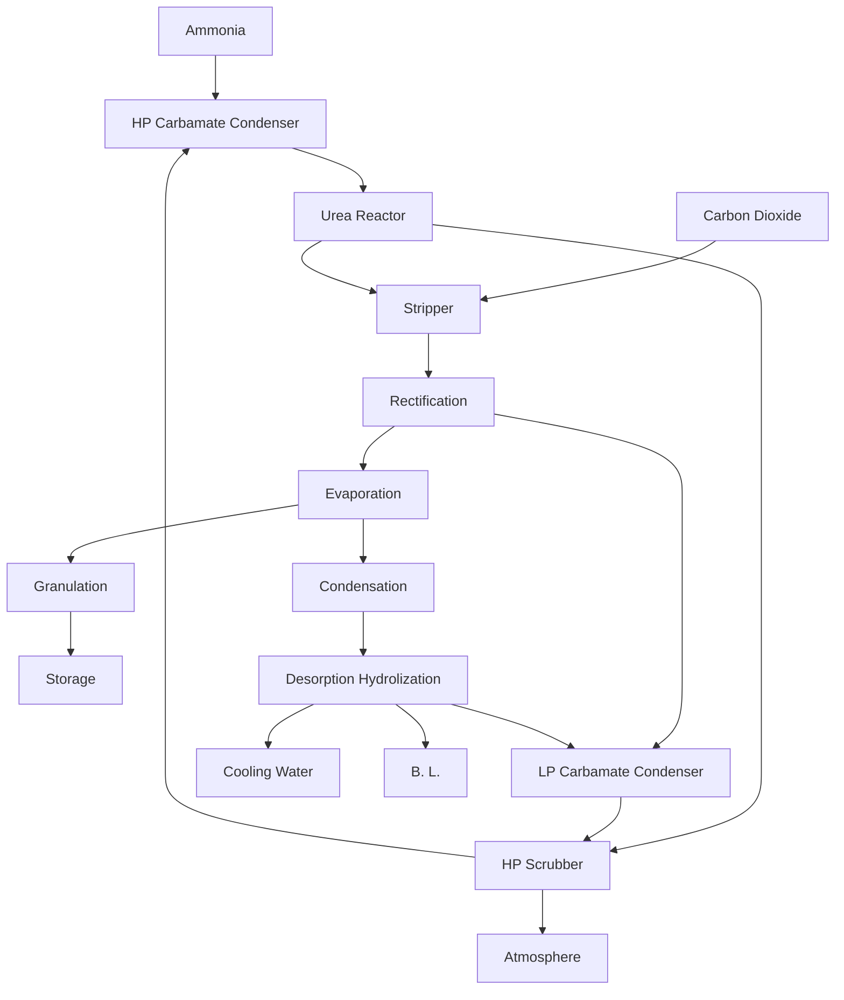

# Uhde Operating Manual - Part III: Urea Plant Helwan

## Table of Contents

* [0 Introduction of Operating Manual](#0-introduction-of-operating-manual)
  * [0.1 Table of contents](#01-table-of-contents)
  * [0.2 Introduction](#02-introduction)
  * [0.3 Table of systems](#03-table-of-systems)
    * [0.3.1 Product and Raw Materials](#031-product-and-raw-materials)
    * [0.3.1.4 Appendix of Introduction](#0314-appendix-of-introduction)
  * [0.4 Appropriate Process Flow Diagrams and P & I Diagrams](#04-appropriate-process-flow-diagrams-and-p--i-diagrams)
* [1 Fundamentals](#1-fundamentals)
  * [1.1 Chemical and physical properties](#11-chemical-and-physical-properties)
    * [1.1.1 Introduction to the urea process](#111-introduction-to-the-urea-process)
    * [1.1.2 Introduction to the granulation](#112-introduction-to-the-granulation)
  * [1.2 Process Description](#12-process-description)
    * [1.2.1 Urea (Unit 320-329)](#121-urea-unit-320-329)
    * [1.2.2 Granulation](#122-granulation)
* [2 Consumption and Production Figures](#2-consumption-and-production-figures)
  * [2.1 Raw materials](#21-raw-materials)
  * [2.2 Products](#22-products)
  * [2.3 Utilities (continuous operation)](#23-utilities-continuous-operation)
  * [2.4 Utilities (intermittent operation)](#24-utilities-intermittent-operation)
  * [2.5 Auxiliary materials](#25-auxiliary-materials)
  * [2.6 Consumption figures](#26-consumption-figures)
  * [2.7 Effluents](#27-effluents)
* [3 Preparation of the Plant for Start up](#3-preparation-of-the-plant-for-start-up)
  * [3.1 General](#31-general)
  * [3.2 Urea (Systems 320-329)](#32-urea-systems-320-329)
  * [3.3 Granulation (System 335)](#33-granulation-system-335)
  * [3.4 UF Storage](#34-uf-storage)

---

## 0 INTRODUCTION OF OPERATING MANUAL

This manual has been composed to provide the personnel concerned with the operation of the plant with the process information required for a good understanding of the relevant process aspects of operation. Experience acquired in similar plants is incorporated herein.
The manual is meant to be an addition to sound knowledge and good insight into the process, gained either from experience elsewhere or due to process training.
In this context this manual is only a broad outline for process operational purposes and may serve as a basis for detailed job instructions or a plant operation manual. Such detailed job instructions or plant operation manual should be adapted to specific local conditions and incorporates instructions issued by equipment manufacturers.
The numerical values given in this manual are design figures, that may be considered indicative of the ranges within which practical values may vary during normal operation. Under no conditions should these values be regarded as guarantee figures.
The information in this manual is given by ourselves as good engineers; it is subject to changes however, and because of its general character no claims may be made as to its completeness.
During or after start-up deviations from this manual might be required.
Given the above, no claims for damages or losses in connection with this manual are accepted.

### 0.2 Introduction
The basic design of the urea plant has been made by Stamicarbon, a subsidiary of DSM (Netherlands), for systems 320, 321, 322, 323, 324, 328, 329 and 335.
The plant is to operate by the total-recycle $CO_2$-stripping process and comprises all systems in one stream with a normal capacity of 1750 MTPD for systems 320, 321, 322, 323, 324, 328, 329 and 2000 MTPD for system 335.

In the Stamicarbon process ammonia and carbon dioxide are mixed in HP carbamate condenser where the carbamate formation takes place.
This carbamate is converted into urea in the reactor. The gas phase from the reactor is led to the HP scrubber. The solution from the HP scrubber is introduced into the HP carbamate condenser via the HP ejector.
Inerts from the HP scrubber are vented into the atmosphere via the LP absorber.
The non-converted ammonia and carbon dioxide in the urea solution from the reactor are partly stripped off in the HP heat exchanger. The gas phase from the HP heat exchanger is led to the HP carbamate condenser, the liquid phase to the recirculation stage.

In the recirculation stage, the major part of the non-converted ammonia and carbon dioxide is removed from the urea solution in the recirculation heater and led via the rectifying column to the LP carbamate condenser.
From the LP carbamate condenser level tank the carbamate solution is recycled to the HP scrubber by means of the HP carbamate pump. The urea solution from the rectifying column is discharged to the urea solution tank via the flash tank and the preevaporator.

The about 80% by wt. urea solution from the urea solution tank is concentrated to about 95% by wt. in the first evaporator and finally to about 98.5% by wt. in the second evaporator. From the separator evaporator II it is led to the granulation (Stamicarbon process). On the way to the granulator formaldehyde (in form of urea/formaldehyde precondensate) is added to the concentrated urea solution as a process aid and anticaking agent. In the granulator liquid urea is sprayed onto seed material in the fluidized state to build urea granules.

All process condensate from the flash tank and evaporation condensers, containing ammonia, carbon dioxide and urea, is collected in the ammonia water tank. Vent gases from several points are washed in circulating process water in the absorbers. Vapours from the total condenser IV are sent to the vent stack. The process condensate is then processed in the desorption section in order to recover nearly all components. These components are recycled to the recirculation, and the clean condensate is used in scrubbing unit of the granulation plant and partly drained to the water treatment system.

### 0.3 Table of systems

| SYSTEM NO. | Description |
| :--- | :--- |
| 320 | $CO_2$ Compression |
| 321 | Ammonia Pumping |
| 322 | Synthesis |
| 323 | Recirculation |
| 324 | Evaporation |
| 328 | Desorption and Hydrolysis |
| 329 | Steam, Condensate and Cooling Water |
| 335 | Granulation |

#### 0.3.1 Product and Raw Materials

The raw materials for the preparation of urea are ammonia and carbon dioxide. Carbon dioxide is obtained as a by-product from the ammonia plant.
Some applications of urea are: soil and leaf fertilisation, melamine production, urea-formaldehyde resins, nutrient for ruminant animals, and miscellaneous other applications.

**0.3.1.1 Appearance and properties of urea ($NH_2-CO-NH_2$)**
Urea is a white crystal, which is not inflammable, not conductive and has the following physical properties:
*   density (solid at 20°C): 1335 $kg/m^3$
*   melting point: 132.6 °C
*   specific heat (melt): 126 J/(mol K)
*   melting heat (melt point): 13.6 kJ/mol
*   mol. weight: 60.056 kg/kmol

**0.3.1.2 Appearance and properties of ammonia ($NH_3$)**
Ammonia is under pressure, a liquified gas, which is recognizable at the smell. Ammonia gas is lighter than air and can be explosive and inflammable under certain circumstances. Ammonia is soluble in water in an exothermic reaction. Ammonia has the following physical properties:
*   density (liquid, 20 bar, 25°C): 603 $kg/m^3$
*   melting point: -78 °C
*   boiling point: -33 °C
*   ignition temperature: 630 °C
*   lower explosion limit (in air): 15 vol.% $NH_3$
*   upper explosion limit (in air): 29 vol.% $NH_3$
*   mol. weight: 17.03 kg/kmol

**0.3.1.3 Appearance and properties of carbon dioxide ($CO_2$)**
Carbon dioxide is a colourless, odourless gas, which is not explosive and not inflammable. Carbon dioxide is heavier than air and has the following physical properties:
*   density (gas, 1 bar, 25 °C): 1.784 $kg/m^3$
*   triple point: -57 °C and 0.0052 bar
*   critical point: 31 °C and 73.7 bar
*   mol. weight: 44.01 kg/kmol

#### 0.3.1.4 Appendix of Introduction - BLOCK DIAGRAM

### 0.4 Appropriate Process Flow Diagrams and P & I Diagrams

#### 0.4.1 Process Flow Diagrams

| No | Description | Doc. No. |
| :--- | :--- | :--- |
| 20 | Urea Synthesis and Recirculation 1750 MTPD | UD-VT-322-FB-0001 |
| 20 | Urea Synthesis and Recirculation 1925 MTPD | UD-VT-322-FB-0002 |
| 21 | Evaporation 1750 MTPD | UD-VT-324-FB-0001 |
| 21 | Evaporation 1925 MTPD | UD-VT-324-FB-0002 |
| 22 | Desorption 1750 MTPD | UD-VT-328-FB-0001 |
| 22 | Desorption 1925 MTPD | UD-VT-328-FB-0002 |
| 24 | Granulation 2000 MTPD | UD-VT-335-FB-0001 |
| 26 | Steam and Condensate Urea-Unit 1750 MTPD | UD-VT-329-FB-0001 |
| 26 | Steam and Condensate Urea-Unit 1925 MTPD | UD-VT-329-FB-0002 |
| 27 | Steam and Cond. Granulation-Unit 2000 MTPD | UD-VT-329-FB-0003 |
| 28 | Cooling Water Urea Unit 1750 MTPD | UD-VT-329-FB-0004 |
| 28 | Cooling Water Urea Unit 1925 MTPD | UD-VT-329-FB-0005 |

#### 0.4.2 P & I Diagrams

| No | Description | Doc. No. |
| :--- | :--- | :--- |
| 101 | Compression | UD-VT-320-FB-0001 |
| 102 | Synthesis | UD-VT-322-FB-0003 |
| 103/1 | Recirculation 1 | UD-VT-323-FB-0001 |
| 103/2 | Recirculation 2 | UD-VT-323-FB-0002 |
| 103/3 | Pulsation Dampener | UD-VT-323-FB-0003 |
| 104 | Desorption and Hydrolyzing | UD-VT-328-FB-0003 |
| 105/1 | Evaporation | UD-VT-324-FB-0003 |
| 105/2 | Evaporation | UD-VT-324-FB-0004 |
| 106 | UF Tank | UD-VT-335-FB-0002 |
| 107/1 | Steam and Condensate 1 | UD-VT-329-FB-0006 |
| 107/2 | Steam and Condensate 2 | UD-VT-329-FB-0007 |
| 108/1 | Utility Stations | UD-VT-329-FB-0008 |
| 108/2 | Steam and Condensate Tracing | UD-VT-329-FB-0009 |
| 108/3 | Steam and Condensate Tracing | UD-VT-329-FB-0010 |
| 108/4 | Steam and Condensate Tracing | UD-VT-329-FB-0011 |
| 109 | Cooling Water | UD-VT-329-FB-0012 |
| 116 | Draining System Synthesis | UD-VT-322-FB-0004 |
| 117 | Draining System Granulation | UD-VT-335-FB-0003 |
| 119 | N/C Measurement | UD-VT-322-FB-0005 |
| 121/1 | $CO_2$ Compressor, Gas Diagram | UD-AU-320-DZ-0001-001 |
| 121/2 | $CO_2$ Compressor, Lube Oil Diagram | UD-AU-320-DZ-0001-002 |
| 121/3 | $CO_2$ Compressor, Seal Gas Diagram | UD-AU-320-DZ-0001-003 |
| 125/1 | $CO_2$ Compressor Steam System | UD-AU-320-DZ-0002-001 |
| 125/2 | $CO_2$ Compressor Lube Oil System | UD-AU-320-DZ-0002-002 |
| 125/3 | $CO_2$ Compressor Control Oil System | UD-AU-320-DZ-0002-003 |
| 125/4 | $CO_2$ Compression, Sealing Steam Diagram | UD-AU-320-DZ-0002-004 |
| 126/1 | Condenser for $CO_2$ Compressor Turbine | UD-VT-320-FB-0002 |
| 126/1 | Steam System for $CO_2$ Compressor Turbine | UD-VT-320-FB-0003 |
| 127/1 | HP-NH3-Pump 321P002 A | UD-AU-321-DZ-0005-001 |
| 127/2 | HP-NH3-Pump 321P002 B | UD-AU-321-DZ-0005-002 |
| 129/1 | HP Carbamate Pump 323P001 A | UD-AU-323-DZ-0013-036 |
| 129/2 | HP Carbamate Pump 323P001 B | UD-AU-323-DZ-0013-037 |
| 130 | Granulator Product | UD-VT-335-FB-0004 |
| 131 | Granulator Air | UD-VT-335-FB-0005 |
| 132 | First Cooler | UD-VT-335-FB-0006 |
| 133 | Screening | UD-VT-335-FB-0007 |
| 134 | Product Cooling | UD-VT-335-FB-0008 |
| 135 | Scrubber | UD-VT-335-FB-0009 |
| 136 | Recycle Tank | UD-VT-335-FB-0010 |
| 137 | Granulation Steam and Condensate | UD-VT-335-FB-0011 |
| 140 | Sprayer Air Fan | UD-AU-335-DZ-0002-001 |
| 170 | Leak Detection System | UD-VT-322-FB-0006 |

---

## 1 FUNDAMENTALS

### 1.1 Chemical and physical properties
This chapter provides the theory and a practical explanation of the process and typical process equipment. This information may be helpful in understanding the causes of deviating process conditions within the design limits and how to restore design conditions, safely and effectively.

#### 1.1.1 Introduction to the urea process

**Chemical reactions**
The production of urea proceeds by a two-stage reaction. Ammonia and carbon dioxide react to form ammonium carbamate:

$$ 2NH_3 + CO_2 \rightleftharpoons NH_4OCONH_2 \quad \Delta H = -117 \text{ kJ/mol} $$

This strongly exothermic reaction reaches an equilibrium very rapidly. The reaction system shown above will hereinafter be referred to the carbamate equilibrium. In the liquid phase, ammonium carbamate is next dehydrated to urea and water:

$$ NH_4OCONH_2 \rightleftharpoons NH_2CONH_2 + H_2O \quad \Delta H = +15.5 \text{ kJ/mol} $$

This endothermic equilibrium reaction is rather slow compared with the first one; the system will hereinafter be called the urea equilibrium.

The above summary data on equilibria and kinetics enable the essence of the lay-out of the urea plant to be derived. Ammonia and carbon dioxide have to be contacted in a device capable of removing large quantities of reaction heat: the HP carbamate condenser. From this HP carbamate condenser the mixture is sent to the reactor, where the second equilibrium is established.

From the fact that the dehydration reaction does not proceed to completion it follows that the unconverted reactants must be removed from the reactor solution. The way in which this is done characterises most urea processes.
The process pressures and temperatures are dictated, as well as the compositions, by the phase behaviour of the four-component mixture (ammonia, carbon dioxide, water and urea), by the inert percentage, and by the desired utility consumption or the steam production of the plant.

**The Stamicarbon total recycle $CO_2$ stripping process**
In the Stamicarbon total recycle $CO_2$ stripping process almost the whole quantity of unconverted reactants is returned to the reactor. A large proportion of the reactants is removed from the reactor solution at the synthesis pressure by contacting this liquid countercurrently with carbon dioxide. By stripping ammonia from the liquid, the carbamate equilibrium is forced to the left, which results in dissociation of the carbamate not converted into urea. The reaction heat needed is supplied by external heating of the stripper (HP heat exchanger) tubes. Owing to the short residence time in the stripper (HP heat exchanger) and the relatively low temperature, the urea equilibrium is prevented from establishing, so that the hydrolysis of urea does not get out of bounds.

The stripped reactor solution is flashed off to a much lower pressure (approx. 4.0 bar) and then subjected to distillative separation to remove residual ammonia and carbon dioxide. After this, these reactants are pumped back, dissolved in water, to the synthesis section.

##### 1.1.1.1 Phase behaviour in the urea process system
To obtain a good understanding of the process, it is essential to know the phase behaviour of mixture containing ammonia, carbon dioxide, urea and water. The phase behaviour of such a quaternary system is far from ideal and rather difficult to understand.
We shall here try to explain the behaviour of mixtures from the properties of their components by application of basic principles from phase theory.

You can classify the four components mentioned above into three groups:
1. the light components, ammonia and carbon dioxide, which in mixtures occur in the liquid phase only at high pressures and/or low temperatures;
2. the medium-weight component, water, which occurs both in the liquid and in the gas phase;
3. the heavy component, urea, which occurs in the gas phase only at very low pressures and/or high temperatures.

The phase transitions are schematically represented in equation 1:
Gas phase: $NH_3 + CO_2 + H_2O$
Liquid phase: $NH_3 + CO_2 \rightleftharpoons NH_4OCONH_2 \rightleftharpoons NH_2CONH_2 + H_2O$

The phase behaviour of this four-component system is largely determined by the behaviour of the binary system ammonia-carbon dioxide.

**Ammonia and carbon dioxide**
Therefore, the simplest description of the behaviour of the four-component mixture is obtained by considering the behaviour of this binary system and then to add the properties of water and urea.
According to the first reaction equation, ammonia and carbon dioxide react to form the salt, ammonium carbamate. For the ammonia-carbon dioxide system this has two important consequences:
1. The reaction of two light components results in the formation of the heavy component ammonium carbamate. The pressure of the mixture will therefore be lower than the pressure of the individual components.
2. The strong interaction between ammonia and carbon dioxide results in azeotropy.
The fact that the dissociation pressure of the ammonium carbamate remains relatively low, also at higher temperatures, has the surprising effect that ammonium carbamate may be present in liquid form while the components constituting it are supercritical.

**Ammonia, carbon dioxide and water**
As said before, water is a medium-weight component compared with ammonia and carbon dioxide. However, these two components differ widely in their behaviour with respect to water. Ammonia is very readily soluble in water, carbon dioxide only very poorly. This means that a liquid phase can only contain carbon dioxide in the bound form, e.g. as ammonium carbamate or, possibly, as ammonium carbonate. The relation between the composition and the maximum temperatures of dew and bubble points is given by the so-called top-ridge lines.

**Ammonia, carbon dioxide, water and urea**
Urea is the heaviest of the four components. This means that, like water, in a liquid phase urea can act as solvent. As the urea fraction becomes greater, the vapour pressure of the mixture will become lower, assuming the temperature to remain constant.
The affinity between ammonia and urea is lower than that existing between ammonia and water, however.

##### 1.1.1.2 The chemical-technological realization of the synthesis process
The chemical-technological realization of the synthesis is determined by the physical and chemical equilibria in the system constituted by ammonia, carbon dioxide, water and urea.
The Stamicarbon total-recycle-carbon-dioxide-stripping-process opts for a synthesis section consisting of four items, viz.
1. HP CARBAMATE CONDENSER,
2. REACTOR,
3. STRIPPER (HP HEAT EXCHANGER), AND
4. HP SCRUBBER.
The first three items together form what is called the synthesis loop. Throughout the synthesis section the same pressure prevails.

Ammonia, carbon dioxide containing stripped reactants, and carbamate recycled from the HP stage are supplied to the HP carbamate condenser. The composition of the mixture at the prevailing pressure is not far from the top-ridge line. The heat of condensation released in the reaction is used for the generation of LP steam. The degree of condensation in the HP carbamate condenser can be controlled by means of the steam pressure.

From the HP carbamate condenser the mixture flows to the reactor. The residence time in the reactor is such that there is enough time to reach the urea equilibrium almost completely.

The stripper (HP heat exchanger) is designed as a counter-current film evaporator: the liquid flows down along the tube wall in a film, and carbon dioxide introduced at the bottom entrains carbamate that has dissociated into ammonia and carbon dioxide. The heat required for the decomposition of carbamate is supplied by condensation of steam. The raw materials for the synthesis, carbon dioxide and ammonia, contain inerts.

**THE OVERALL PROCESS. PHYSICAL AND CHEMICAL EQUILIBRIA.**
In the reactor, liquid-phase ammonium carbamate is converted into urea and water. This conversion is an endothermic equilibrium reaction.
Both reflect the composition of the so-called initial mixture, (e.g. the hypothetical mixture consisting only of $NH_3$, $CO_2$ and $H_2O$, if both reactions are shifted completely to the left).

Increasing the $NH_3/CO_2$ ratio (increasing the $NH_3$ concentration) increases $CO_2$ conversion, but reduces $NH_3$ conversion. Increasing the amount of water in the initial mixture (increasing the $H_2O/CO_2$ ratio) results in a decrease in both $CO_2$ and $NH_3$ conversion.
The equation for the net of the urea formation shows that this net rate decreases as the carbamate concentration becomes lower and the urea and water concentrations become higher. The closer the chemical equilibrium is approached, the lower the reaction rate will be. Therefore, the reactor installed is given such a volume (residence time) as ensures that equilibrium conversion will be attained to 95% by wt. Residence time in the reactor is about one hour.

**THE STRIPPER (HP HEAT EXCHANGER)**
As the urea formation reaction does not proceed to completion, non-converted ammonia, carbon dioxide and ammonium carbamate must be removed from the reactor solution. These reactants are for the major part recovered at synthesis pressure in the HP stripper and recycled to the HP carbamate condenser.

##### 1.1.1.3 The technical realization of the synthesis process
The HP equipment is protected against corrosion in two ways:
1. by a suitable choice of materials of construction and
2. by the use of oxygen as a corrosion-inhibitor.

*The HP carbamate condenser:*
The HP carbamate condenser is a vertical shell and tube heat exchanger. Condensation of gasses takes place in the tubes of the condenser. The heat of condensation is removed by the generation of low pressure steam at the shell side. Liquid ammonia is supplied from outside battery limits.

*The reactor:*
As said before, the reactor should satisfy two requirements:
1. A plug flow with sufficient residence time
2. A good contact between the gas phase and the liquid phase
Both these requirements are fulfilled in that the reactor is designed as a co-current gas-bubble reactor with sieve trays.

*The stripper (HP heat exchanger):*
For proper functioning of the HP stripper every HP stripper tube should receive the same quantity of liquid per unit time. Good liquid distribution implies good gas distribution, ensuring a sufficient supply of oxygen for protection from corrosion.

*The HP scrubber:*
In the HP scrubber the off-gas from the reactor is stripped of ammonia and carbon dioxide by means of carbamate recycled from the low-pressure stage.

##### 1.1.1.4 The low-pressure recirculation stage
After being flashed to about 4.0 bar and a temperature of 120 °C, the stripped reactor solution is freed of remaining quantities of unconverted reactants in a rectifying column in which the liquid is heated to about 135 °C. At this pressure and temperature nearly all ammonia and carbon dioxide are driven out. The gases leaving the rectifying column are passed to a LP carbamate condenser.

##### 1.1.1.5 The evaporation process
In the evaporation section the water/urea mixture from the recirculation section is further concentrated. To minimize hydrolysis and biuret formation, the evaporation section is operated at a relatively low temperature using a reduced pressure. The minimum melt temperature has been fixed at about 130-135 °C. For a containing only 4% by wt. water, the corresponding equilibrium pressure is about 0.3 bar.

##### 1.1.1.6 The desorption and hydrolyzation section
In this section most of the remaining ammonia, carbon dioxide and urea is removed from the process condensate. This treatment protects the environment and recovers valuable reactants and consists of four steps.

Urea hydrolyses according to the following equations:
$$ NH_2CONH_2 \rightleftharpoons NH_4^+ + NCO^- $$ (Ammonium-Isocyanate)
$$ NH_4^+ + NCO^- \rightleftharpoons 2NH_3 + CO_2 $$

##### 1.1.1.7 Biuret formation
During the urea formation, biuret is formed as a by-product, according to the equation:
$$ 2 NH_2CONH_2 \rightleftharpoons NH_2CONHCONH_2 + NH_3 $$
This is a slow, endothermic equilibrium reaction. Biuret formation will take place when there is a high urea concentration, a low ammonia concentration and a high temperature. As biuret is toxic to plants, the biuret content of fertilizer-grade urea will have to be kept as low as possible.

##### 1.1.1.8 The hydrogen removal
Together with the carbon dioxide from battery limits relatively small quantities of gases that are inert relative to urea formation are introduced into the process (hydrogen, nitrogen, methane, carbon monoxide and noble gases). Hydrogen is removed from the carbon dioxide by catalytic oxidation to water using a 0.3% by wt. platinum on alumina catalyst.

##### 1.1.1.9 Glossary of terms
*   **Isotherm**: A collection of compositions and pressures occurring under conditions of constant temperature.
*   **Isobar**: A collection of compositions and temperatures occurring under conditions of constant pressure.
*   **Top-ridge line**: An isobar in the phase diagram representing maximum bubble points or maximum dew points.
*   **System pressure**: The sum of the partial pressures of the components ammonia, carbon dioxide, water and urea, contained in a mixture.
*   **Synthesis pressure**: The sum of the system pressure and the partial pressures of all other substances contained in a mixture.
*   **Molar ratio**: The ratio between the number of moles of ammonia and the number of moles of carbon dioxide in a given place.
*   **N/C ratio**: The ratio between the number of moles of nitrogen and the number of moles of carbon in the reaction system.

##### 1.1.1.10 Physical properties

**Ammonia ($NH_3$)**
| Property | Value | Unit |
| :--- | :--- | :--- |
| Molecular weight | 17.031 | kg/kmol |
| Critical temperature | 132.4 | °C |
| Critical pressure | 113.7 | bar |
| Boiling point | -33.35 | °C at 1.013 bar |

**Carbon dioxide ($CO_2$)**
| Property | Value | Unit |
| :--- | :--- | :--- |
| Molecular weight | 44.010 | kg/kmol |
| Critical temperature | 31.04 | °C |
| Critical pressure | 74.29 | bar |

**Urea ($NH_2CONH_2$)**
| Property | Value | Unit |
| :--- | :--- | :--- |
| Molecular weight | 60.056 | kg/kmol |
| Specific gravity | 1335 | kg/m³ at 20 °C |
| Viscosity | 2.16 | mPas at 150 °C |
| Specific heat of molten urea | 2.09 | kJ/kg K |
| Remelting heat | 251.2 | kJ/kg (15.1 kJ/mol) |
| Crystallization point | 132.6 | °C |

**Biuret ($NH_2CONHCONH_2$)**
| Property | Value | Unit |
| :--- | :--- | :--- |
| Molecular weight | 103.081 | kg/kmol |
| Specific gravity | 1467 | kg/m³ at -5 °C |
| Crystallization point | 180-190 | °C |

**Carbamate ($NH_2COONH_4$)**
| Property | Value | Unit |
| :--- | :--- | :--- |
| Molecular weight | 78.071 | kg/kmol |
| Crystallization point | 153 | °C |

##### 1.1.1.11 Graphs
*   FIGURE 1: LIQUID-GAS EQUILIBRIA OF THE SYSTEM $CO_2 - NH_3$
*   FIGURE 2: LIQUID-GAS EQUILIBRIA OF THE SYSTEM $CO_2 - NH_3 - H_2O$
*   FIGURE 3: COMPOSITION TRIANGLE FOR THE QUASI-TERNARY SYSTEM $CO_2 - NH_3 - Ur. H_2O$
*   FIGURE 4: $CO_2$ CONVERSION IN LIQUID PHASE / TEMPERATURE
*   FIGURE 5: $NH_3$ CONVERSION IN LIQUID PHASE / TEMPERATURE
*   FIGURE 6: $CO_2$ CONVERSION IN LIQUID PHASE - $NH_3/CO_2$ RATIO
*   FIGURE 7: $NH_3$ CONVERSION IN LIQUID PHASE - $NH_3/CO_2$ RATIO
*   FIGURE 8: $CO_2$ CONVERSION IN LIQUID PHASE - $H_2O/CO_2$ RATIO
*   FIGURE 9: $NH_3$ CONVERSION IN LIQUID PHASE - $H_2O/CO_2$ RATIO
*   FIGURE 10: UREA CONCENTRATION IN LIQUID PHASE - TEMPERATURE
*   FIGURE 11: UREA CONCENTRATION IN LIQUID PHASE - $NH_3/CO_2$ RATIO
*   FIGURE 12: UREA CONCENTRATION IN LIQUID PHASE - $H_2O/CO_2$ RATIO
*   FIGURE 13: THEORETICAL EQUILIBRIUM STAGE IN HP STRIPPER
*   FIGURE 14: STRIPPING OF UREA SYNTHESIS SOLUTION WITH $CO_2$
*   FIGURE 15: THREE PHASE EQUILIBRIA OF SYSTEM UREA - WATER
*   FIGURE 16: LIQUID GAS EQUILIBRIUM OF AMMONIA
*   FIGURE 17: DENSITIES/VAPOUR PRESSURES OF SATURATED/NOT SATURATED UREA SOLUTIONS
*   FIGURE 18: SPECIFIC VOLUME OF LIQUID AMMONIA

#### 1.1.2 Introduction to the granulation
The plant is based on the fluid bed granulation process developed by DSM, The Netherlands and designed by Stamicarbon bv, the licensing subsidiary of DSM. In the DSM fluid bed granulation process, granular urea is produced by film spraying of concentrated urea solution onto passing seed material in fluidised state.
The basic characteristics of this process are:
*   the liquid urea is a concentrated solution (melt) >98.2% wt;
*   the spraying occurs in the core of a fluidised layer by means of a large number of spray heads;
*   the particle size enlargement is achieved by scale granulation, i.e., growth of the seed or nucleus granules by continuous solidification of very thin layers of urea melt onto the surface of the initial particles;
*   formaldehyde (in the form of urea/formaldehyde solution) is added to the concentrated urea solution before spraying.

---

### 1.2 Process Description

#### 1.2.1 Urea (Unit 320-329)

##### 1.2.1.1 General
All numerical values given in this process manual for such parameters as pressures, temperatures, compositions, etc., at various places in the plant are subject to minor deviations.

##### 1.2.1.2 Ammonia and carbon dioxide supply
Liquid ammonia and carbon dioxide gas are brought to the synthesis pressure.
**Ammonia**: Liquid ammonia enters at battery limits at a temperature of about 25 °C and a pressure of 26 bar, indicated by T1321001/002 and PI321253/256 (PI321201/202). The total ammonia input flow to synthesis is measured and indicated by FQI321401.

**Carbon Dioxide**: Before carbon dioxide compressor 320K002, air is supplied by means of process air compressor 320K001 or from the $NH_3$-plant to the carbon dioxide stream. This air addition serves two services:
1. for the hydrogen combustion after 2nd stage of the compressor in the $H_2$ removal reactor 320R001
2. Anti-corrosion agent in the synthesis section.

**Hydrogen removal**: The carbon dioxide is sent through the hydrogen removal reactor for catalytic removal of the hydrogen. The reactor is filled with a platinum-on-aluminum-oxide catalyst. In the reactor hydrogen is converted into water through catalytic combustion.

##### 1.2.1.3 Synthesis
Ammonia and carbon dioxide are mixed in HP carbamate condenser 322E002, where carbamate formation takes place. This carbamate is converted into urea in reactor 322R001. The gas phase from the reactor, containing non-converted ammonia and carbon dioxide as well as inerts, is discharged to the HP scrubber 322E003.
In the HP scrubber the condensation of ammonia and carbon dioxide is effected. The heat of condensation is partly removed by circulating conditioned cooling water with an inlet temperature of about 80 °C.

##### 1.2.1.4 Recirculation
In the recirculation stage the major part of the non-converted ammonia and carbon dioxide is removed from the urea solution in recirculation heater 323E002 and, via rectifying column 323C003, is led to LP carbamate condenser 323E003.
The urea-carbamate solution leaving the bottom part of the HP heat exchanger is expanded to about 4.1 bar via LV322501.

##### 1.2.1.5 Evaporation
The urea solution from rectifying column 323C003 passes level control valve LV323501 and is discharged via flash tank 323F004, pre-evaporator 323E010 and separator 323F010 to urea solution tank 323D002.
The urea solution leaving rectifying column 323C003 has the following composition:
*   Urea: 68.7 wt.%
*   Biuret: 0.4 wt.%
*   $CO_2$: 1.1 wt.%
*   $NH_3$: 2.1 wt.%
*   $H_2O$: 27.7 wt.%
The temperature is 135 °C and the pressure 4.12 bar.

##### 1.2.1.6 Absorption, Desorption and Hydrolysis
Process condensate is condensate that can contain $NH_3$, $CO_2$ and urea. It may come from several parts of the plant and is collected in $NH_3$ water tank 328D003. All vent gases from several points are washed in process water in atm. absorber 323C005. The process condensate is then processed in two desorbers 328C002/04 and the hydrolyzer 328C003 in order to recover nearly all components.

##### 1.2.1.7 Steam and Condensate
Steam of three different pressures is used in the urea plant, i.e.:
*   MP steam of 25 bar and 330 °C from battery limits,
*   LP steam of 9.0 bar, saturated,
*   LP steam of 4.4 bar, saturated.

#### 1.2.2 Granulation

##### 1.2.2.1 General process description
Urea melt, with a concentration of about 98.5 wt%, is transferred to granulator 335R001 by means of urea melt pump 335P001 A/B. The urea formaldehyde is delivered from battery limits into UF tank 335D002. The formaldehyde containing urea melt is sprayed as a very thin film in a fluidised bed of urea particles in granulator 335R001.

##### 1.2.2.2 Detailed process description
(Detailed descriptions of melt feeding, granulation bed parameters, urea formaldehyde dosing system, sprayer air circuit, fluidisation air circuit, solids circuit, and final cooling.)

**Equipment name only list**
| Item | Description | PID Remarks |
| :--- | :--- | :--- |
| 335A001 | Sampling unit | 134 |
| 335C001 | Granulator scrubber | 135 |
| 335C002 | Cooler scrubber | 135 |
| 335D001 | Start-up bin | 132 |
| 335D002 | Scrubber tank | 135 |
| 335D004 | Recycle tank | 136 |
| 335D005 | NH3 separator | 134 |
| 335D006 | Hopper | 133 |
| 335D007 | UF tank | 106 |
| 335E001A/B/C | Granulator fluidization air heater A | 131 |
| 335E002 | Sprayer air heater | 131 |
| 335E003 | First cooler | 132 |
| 335E004 | First cooler air preheater | 132 |
| 335E007 | Final cooler | 134 |
| 335E008 | Final cooler air cooler | 134 |
| 335E009 | Final cooler air heater | 134 |

---

## 2 CONSUMPTION AND PRODUCTION FIGURES

### 2.1 Raw materials
**2.1.1 Ammonia, liquid**
Pressure (abs): approx. 26.0 bar
Temperature: approx. 25.0 °C

**2.1.2 Carbon dioxide, gas**
Pressure (abs): approx. 1.30 bar
Temperature: approx. 35 °C

### 2.2 Products
The urea synthesis plant is designed for a capacity of 1750 metric tons/day urea. The urea granulation plant is designed for a capacity of 2000 metric tons/day urea granules.

**2.2.1 Urea granules**
a) Size (Screen analysis of final product)
*   medium size 2.0-4.0 mm min. 90%
*   undersize <1.0 mm max. 1%
b) Analysis
*   Biuret 1.0 % wt max.
*   Water 0.3 % wt max.
*   Formaldehyde (100%) 5.5 kg/t of urea max.
*   Hardness 3.0 kg min on 3.15 mm fraction

**2.2.2 Steam**
The heat liberated during the urea production is utilized to generate 4.4 bar saturated steam.

**2.2.3 Condensate**
The steam condensate obtained in the urea plant during normal operation is transferred to water treatment unit with following approx. conditions:
*   Quantity: 29.7 t/h
*   Pressure: approx. 9.0 bar
*   Temperature: 100 °C

### 2.3 Utilities (continuous operation)
*   **Electric power**: See basis of design.
*   **Cooling water**: Inlet temperature: 30 °C, Outlet: 40 °C (max. 42 °C), Inlet pressure (abs.): approx. 3.6 bar
*   **Steam**: HP-superheated steam is required for the urea plant for turbine of CO2 compressor. Pressure (bar abs.): 25.0 / 107.8. Temperature (°C): 330 / 505.
*   **Process air**: Atmospheric air is added to the carbon dioxide by means of air compressor 302K001.

### 2.4 Utilities (intermittent operation)
*   Deaerated demin. water
*   Fire water
*   Potable water
*   Plant air

### 2.5 Auxiliary materials
**2.5.1 Urea formaldehyde precondensate UF 85**
Used as granulating and anticaking additive to the urea solution.
*   Formaldehyde approx. 60 % wt.
*   Urea 25 % wt.
*   Water 15 % wt.

**2.5.2 Urea granules**
Quantity approx. 40 t (About 30 t is min. for one filling of granulator).

### 2.6 Consumption figures
*   Ammonia: 40907 kg/h
*   Carbon dioxide: 52980 kg/h
*   HP-Steam: 66.9 t/h
*   Electric energy: Urea production: 1374 kW; Urea granulation: 3925 kW
*   Cooling water: 4847 t/h (excluding Unit 320)
*   Urea formaldehyde UF 85: 625 kg/h
*   Oxygen Scavenger: 4.725 g/h Hydrazin 100%

### 2.7 Effluents
**2.7.1 Liquid effluents**
1. The water with solved CO2 from the CO2-knock out drum (320F001). Quantity: approx. 1 m³/h
2. The process condensate with traces of urea and ammonia. Quantity: approx. 17.7 m³/h
3. The water created due to dehumidification in the moisture separator 335S010. Quantity: approx. 1 m³/h

**2.7.2 Gaseous effluents**
1. Off-gas discharged from LP absorber 322C001 to atmosphere (approx. 1578 kg/h).
2. Off-gas discharged from vent stack 328V001 to atmosphere (approx. 104 kg/h).
3. Exhaust air discharged from stack 335V001 to atmosphere (approx. 692,579 kg/h).

---

## 3 PREPARATION OF THE PLANT FOR START UP

### 3.1 General
See also maintenance instructions section 7.1.

### 3.2 Urea (Systems 320-329)
#### 3.2.1 Introduction
The water run has to continue until all shift personnel concerned are familiar with the sections for which they are responsible.

#### 3.2.2 Cleaning
Before raw materials are admitted into the plant or a part of the plant, all lines and processing equipment items must be cleaned. Mechanical cleaning may be necessary to remove large impurities. Flushing with liquids or gases should be executed.

#### 3.2.3 Actions to be taken after cleaning
Remove all blanks used for flushing purposes. Remove all spool pieces. Install process orifice plates, process filters and non-return valves.

#### 3.2.4 Air test for checking the liquid distribution system of 322E001
Uniform distribution of the process liquid over the stripper tubes is essential for proper functioning of the stripper. Tests should be performed after erection and during annual shut downs.

#### 3.2.5 Vacuum test evaporation
The vacuum system of the whole evaporation must be tested for leaks. The required vacuum should be reached in a reasonable short time, about 15 minutes.

#### 3.2.6 Purpose of water run
Simulation of the process conditions, familiarizing staff with the plant, adjusting and checking instruments, checking the mechanical installation and testing for tightness.

#### 3.2.7 Water run
Preparation:
Install temporary line connections between the urea solution tank 323D002 and the ammonia water tank 328D003. Start up carbon dioxide compressor. Fill steam condensate tank 329D001.

Execution of Water Run:
Supply condensate to the synthesis via the HP ammonia supply line, first via the small bypass with orifice, at around 80 bar via the main valve. Fill up the reactor. Maintain a level of 20% on automatic operation.

Draining after water run:
After the water run all equipment must be depressurized and drained.

### 3.3 Granulation (System 335)
Perform hydraulic pressure tests, test control valves, check valve interlock sequence, testrun blowers and air lines, and first load of start up bin.

### 3.4 UF Storage
#### 3.4.1 Inspection and cleaning
Standard inspection protocols and tank cleaning procedures apply to UF tanks 335D007.
